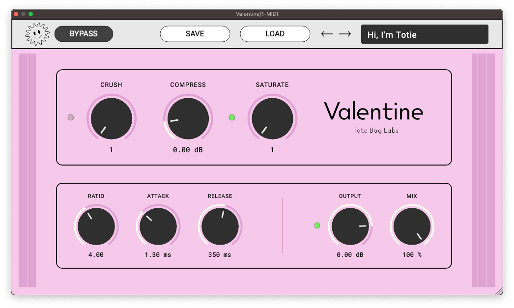

[](https://github.com/Tote-Bag-Labs/valentine/actions/workflows/cmake_ctest.yml)


V A L E N T I N E
==================
Valentine is a compressor and distortion processor. It was inspired by the hyper compressed
and crushed textures in the seminal Justice record, †. Using it is easy: turning input up makes the signal
louder, more compressed, and more saturated. Turning crush up adds digital distortion.

The real fun is in processing signal with some ambience, be it a room or a reverb. With the right input gain
and release settings, you can introduce pumping and breathing artifacts.

Though designed for aggressive (over) application, Valentine is flexible enough to use in a wide variety of 
applications. Try it today!

I stream and make videos about the development process on [YouTube](https://maps.app.goo.gl/m4TwNJUNDj2CvtMt6).
I also wrote a few blog posts about it [here](https://josediazrohena.github.io/).

Getting Valentine
=================
Download the latest precompiled binaries [here](https://github.com/Tote-Bag-Labs/valentine/releases/latest).

AU and VST3 on MacOs and VST3 on Windows are currently supported.

Using Valentine
===============

Signal Path
----------
Valentine is a non-linear processor. As such, knowing the signal path makes it easier
to get your desired result. Here it is:

**Crush** -> **Compress** -> **Saturate** -> Soft Clip -> **Output** -> **Mix**

Parameters
----------
- **Crush**: increases the amount of bit crushing. Downsamples the signal to 27.5kHz. Enabled using the Crush button.
- **Compress**: sets the gain applied to signal before compression. Use this to increase the amount of compression and distortion affecting the signal.
- **Saturate**: sets the amount of gain applied to signal before Valentine's waveshaper. Gain is compensated to prevent huge volume boost when you just want more dirt. Enabled using the Crush Enable Button.
- **Ratio**: sets the compression ratio. "Infinity" is more like 1000:1. Increasing this also increases threshold and decreases knee.
- **Attack**: sets compression attack time.
- **Release**: sets compression release time.
- **Output**: sets wet signal output gain before mix. Output clipping can be enabled with the Clip button.
- **Mix**:  increases the amount of wet signal in the processor's output.
- **Bypass**: bypasses all processing.

Building Valentine
==================

Xcode
-----

Currently, `Xcode 14.2` is supported for building Valentine.

Here's how to create an Xcode project for building the plugin.

```
git clone https://github.com/Tote-Bag-Labs/valentine.git
cd valentine
git submodule update --init --recursive
cmake -B builds -G Xcode
```

Other (for now)
---------------

If you'd rather just build it from the command line, run
`cmake --build Builds --config Release`


Contributing to Valentine
=========================

If you'd like to get involved, take a look at [issues.](https://github.com/tote-bag-labs/valentine/issues) I could use help on anything marked [bug](https://github.com/tote-bag-labs/valentine/labels/bug) or [enhancement](https://github.com/tote-bag-labs/valentine/labels/enhancement).

I'm currently not taking pull requests for new features.
